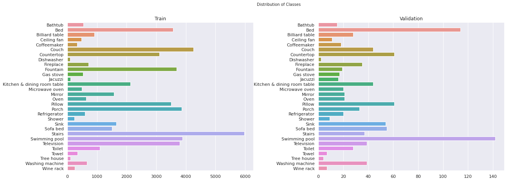
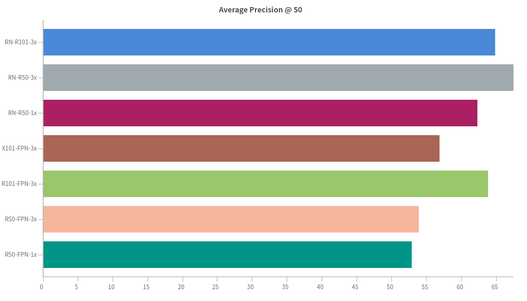

# Airbnb's Amenity Detection with Detectron2

- [Airbnb's Amenity Detection with Detectron2](#airbnbs-amenity-detection-with-detectron2)
  - [Overview](#overview)
  - [Dataset description](#dataset-description)
  - [Data Prepartion](#data-prepartion)
  - [Register Custom Datasets](#register-custom-datasets)
  - [Configuration setup](#configuration-setup)
  - [](#)
  - [Model Building Steps:](#model-building-steps)
  - [References:](#references)

## Overview


## Dataset description

Google's public available Open Images V5 has been used which contains 15.4M annotated bounding boxes for over 600 object categories. It has 1.9M images and is largest among all existing datasets with object location annotations. The classes include a variety of objects in various categories. It covers classes varying from different kinds of musical instruments(e.g. organ, cello, piano etc.) to different kinds of aquatic animals(e.g. goldfish, crab, seahorse, oyster etc.) to various kinds of kitchenware(e.g. spoon, kitchen knife, frying pan, dishwasher) and so on.

Since our focus is on animitey detection, I filtered out images corresponding to objects that don't fall in this category. Below are choosen subset of classes that relate most to Airnb business.

```py
{
'Bathtub',
 'Bed',
 'Billiard table',
 'Ceiling fan',
 'Coffeemaker',
 'Couch',
 'Countertop',
 'Dishwasher',
 'Fireplace',
 'Fountain',
 'Gas stove',
 'Jacuzzi',
 'Kitchen & dining room table',
 'Microwave oven',
 'Mirror',
 'Oven',
 'Pillow',
 'Porch',
 'Refrigerator',
 'Shower',
 'Sink',
 'Sofa bed',
 'Stairs',
 'Swimming pool',
 'Television',
 'Toilet',
 'Towel',
 'Tree house',
 'Washing machine',
 'Wine rack'
}
```

This article nicely expalins download procedure in detail 
https://www.learnopencv.com/fast-image-downloader-for-open-images-v4/

**Classes distribution in Train and Test sets**


## Data Prepartion

Finally, Downloaded Raw Datas et from open images contains following files:

``` yaml
Images: Raw images are placed in the folder. images are named under unique ids as 'id.jpg'.
  train- images folder for training model
  validation- images folder for model validation

Annotations-file: annotations are provided in csv files with image_id, object class_id, coordinates of annotation boxes that corresponding to object.
  - train-annotations-bbox.csv
  - validation-annotations-bbox.csv

class-description: contains mapping info class_id to object name.
  class-descriptions-boxable.csv
```

Labels comprising category and bounding box are in csv format. Since we are using **Detectron** model, it expects labels in JSON format in [COCO style](https://www.immersivelimit.com/tutorials/create-coco-annotations-from-scratch). For that ```modules/preprocessing.py``` script is used. 

Below is sample label   
``` json
{"file_name": "train/cmaker-bathtub-treehouse-train/e43f28c69c3bb136.jpg", 
"image_id": 55, 
"height": 1024, 
"width": 732, 
"annotations": [{"bbox": [0.0, 0.0, 731.0, 1023.0], "bbox_mode": 0, "category_id": 0}, 
                {"bbox": [0.0, 0.0, 731.0, 1023.0], "bbox_mode": 0, "category_id": 0}]}
```

## Register Custom Datasets

Detectron2 comes up with trained models that can be downloaded in the [Detectron2 Model Zoo](https://github.com/facebookresearch/detectron2/blob/master/MODEL_ZOO.md). The advantage is models are trained on large datasets that may already have objects from our datasets. This will save lot a time involved in learning from scratch only fine-tuning is required.

Models form ojective detection are trained on [COCO](https://cocodataset.org/#home) dataset, a large-scale object detection, segmentation, and captioning dataset with scenes containing common objects in their natural context. If we are training model on COCO dataset Detectron knows how to obtain but need to [register custom data](https://detectron2.readthedocs.io/tutorials/datasets.html) implement a function to obtain required info in dictionary format.

## Configuration setup

One nice feature about **Detectron2** is all the training parameters are passed via config file that holds a key-value pairs i.e custom settings can be declred in config file without touching core model. This makes experimentation and tracking results very convinent. More info about configuration setup can be found [here](https://detectron2.readthedocs.io/tutorials/configs.html).

## 

## Model Building Steps:
1. **Architecture Selection** - There several pretrained models available in ```model_zoo```  modules. Inordeder to comeup with best model for our problem I have tried with few of them, suitable for our problem type, on small subset data with three categories ```["Bathtub", "Coffeemaker", "Tree house"]``` fixing all other hyperparameters.

Selected models  with their config path
```yml
models = {
    "R50-FPN-1x": "COCO-Detection/faster_rcnn_R_50_FPN_1x.yaml",
    "R50-FPN-3x": "COCO-Detection/faster_rcnn_R_50_FPN_3x.yaml",
    "R101-FPN-3x": "COCO-Detection/faster_rcnn_R_101_FPN_3x.yaml",
    "X101-FPN-3x": "COCO-Detection/faster_rcnn_X_101_32x8d_FPN_3x.yaml",
    "RN-R50-1x": "COCO-Detection/retinanet_R_50_FPN_1x.yaml",
    "RN-R50-3x": "COCO-Detection/retinanet_R_50_FPN_3x.yaml",
    "RN-R101-3x": "COCO-Detection/retinanet_R_101_FPN_3x.yaml"
}
```

with following configuration

```py
workers = 2
ims_per_batch = 1                    # lower memory issues 
lr = 0.00025
max_iter = 3000
seed = 33                            # for reproducibility
num_classes = 3
```

Results:



I selected top two models. Going forward, experiments will be carried out only for these models.

1. **Hypertuning Parameters** - It is really espensive to try out hyperparameter search using entire dataset. So, it advised to take out subset data and test models on this set to comeup with best model parameters.

## References:
Airnb  project article: https://medium.com/airbnb-engineering/amenity-detection-and-beyond-new-frontiers-of-computer-vision-at-airbnb-144a4441b72e

Detectron2: https://github.com/facebookresearch/detectron2

Data Download: https://www.learnopencv.com/fast-image-downloader-for-open-images-v4/


Experiment tracking: https://lambdalabs.com/blog/weights-and-bias-gpu-cpu-utilization/

Data Augumentation: https://medium.com/@lessw/state-of-the-art-object-detection-use-these-top-3-data-augmentations-and-google-brains-optimal-57ac6d8d1de5#:~:text=The%20top%203%20augmentations%20used,bounding%20box%20size%20must%20increase.

